### Screenshot Hasil

#### Tampilan CRUD Review
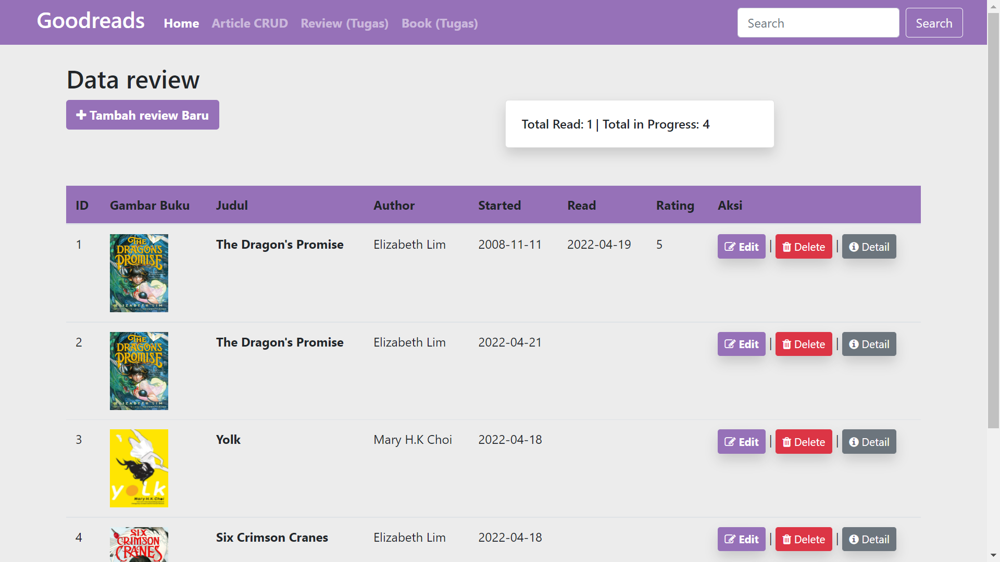
#### Tampilan Form Review
Input akan menampilkan data judul yang sebelumnya ada di database apabila sudah ada, dan autofill untuk data penulis apabila terdapat judul. Apabila tidak ada, bisa menginputkan manual. 
Akan menginsert ke dua tabel apabila data buku belum ada di database. 
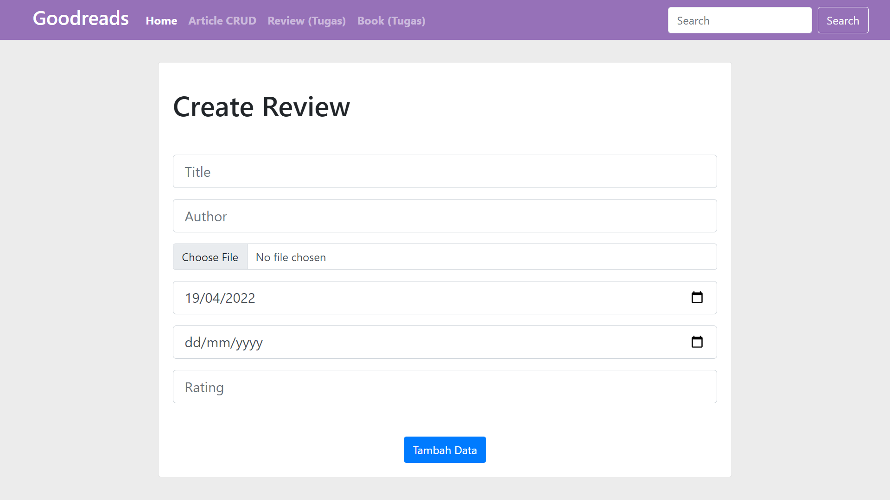
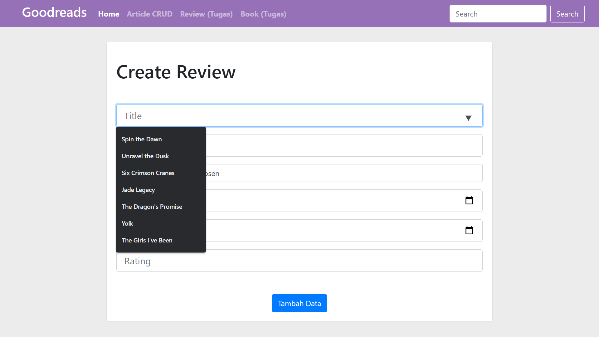
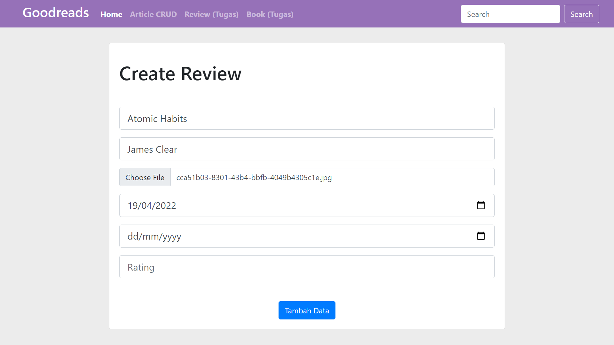
#### Tampilan CRUD Review Setelah Create Baru
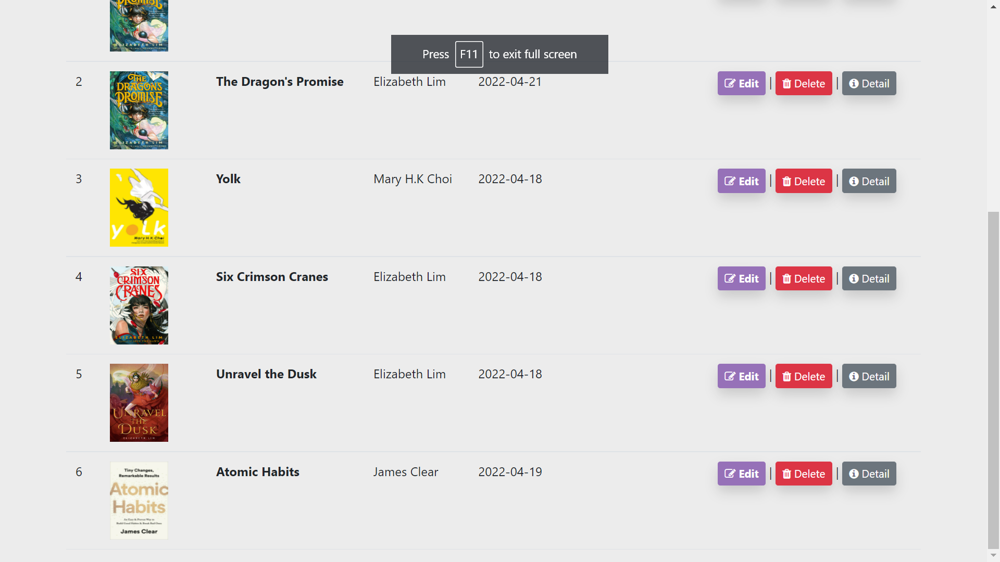
#### Tampilan Tabel Buku Setelah Create melalui Form Review
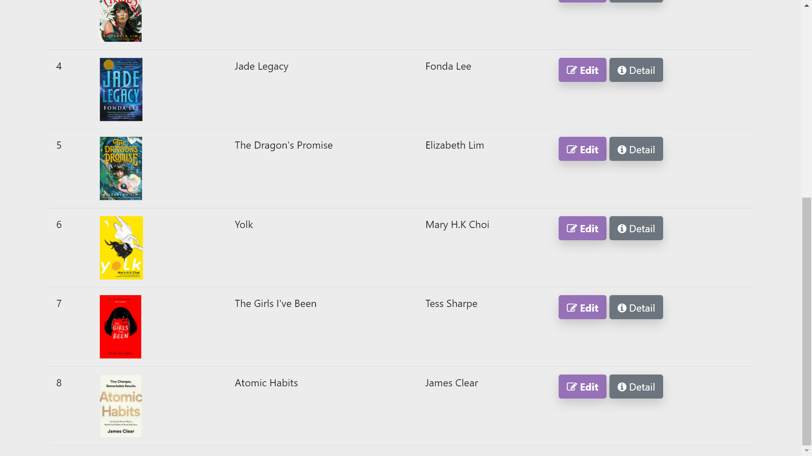
#### Tampilan Edit Review
Apabila mengubah judul buku, apabila data buku tidak ada sebelumnya akan dilakukan insert ke tabel buku. Apabila tidak (hanya mengubah penulis/foto), mengupdate pada tabel buku, dan apabila hanya mengupdate review (seperti tanggal dan rating), akan mengupdate pada tabel review. 
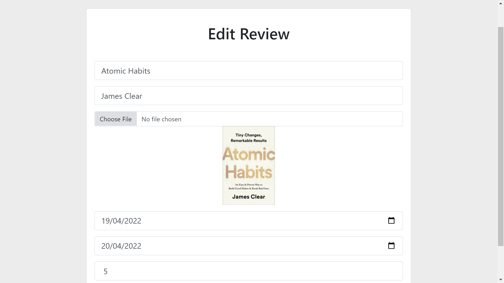
#### Tampilan CRUD Review setelah Edit Form
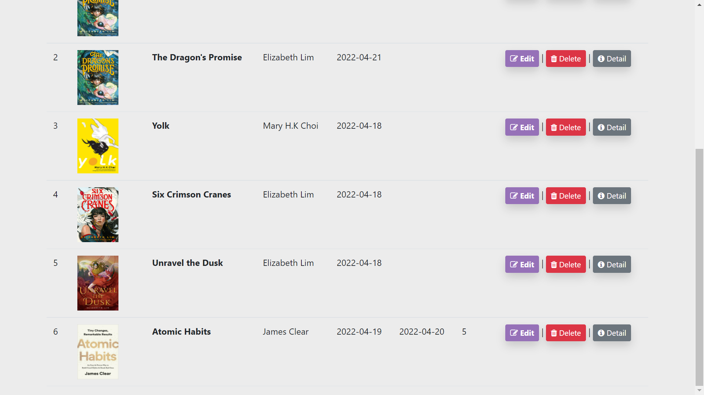
#### Menghapus Review
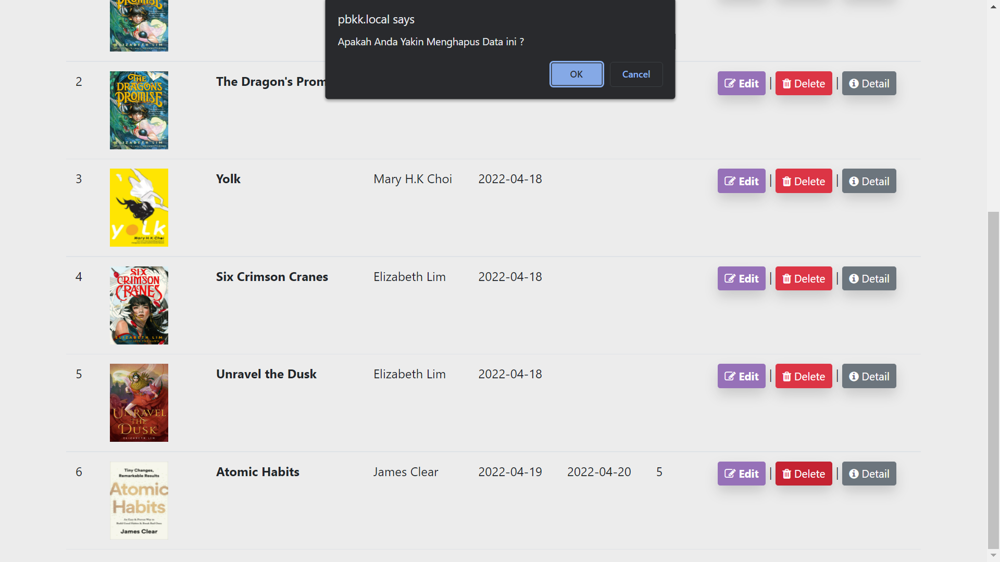

#### Tampilan CRUD Review Setelah Menghapus

#### Tampilan Detail Review
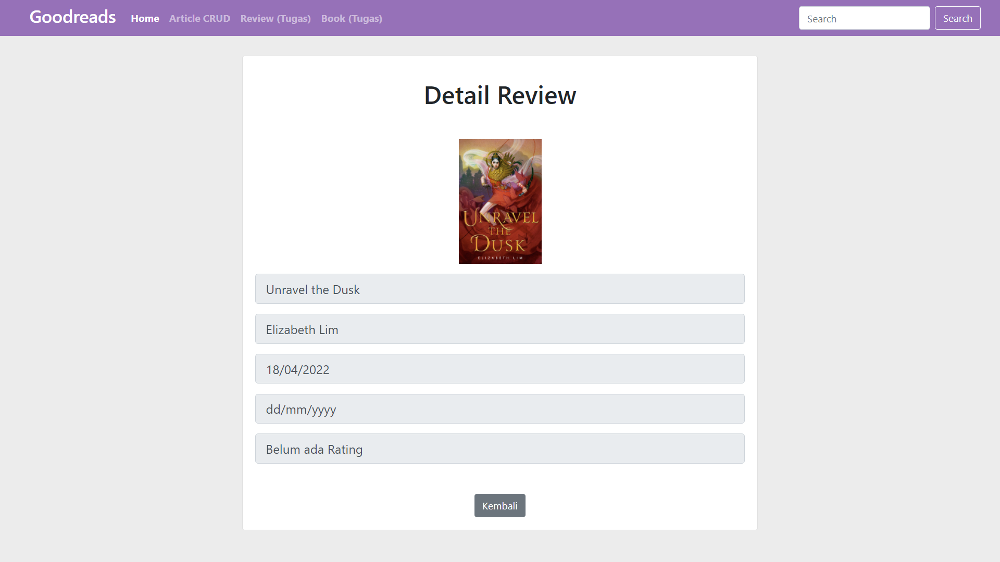

#### Tampilan Tabel Buku (Edit/Detail)
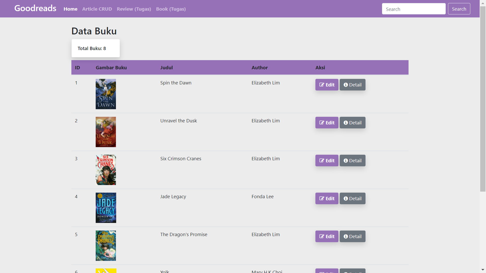

#### Tampilan Detail Buku dan Review2 yang Dilakukan
Dapat melihat review-review pada buku yang sama. 
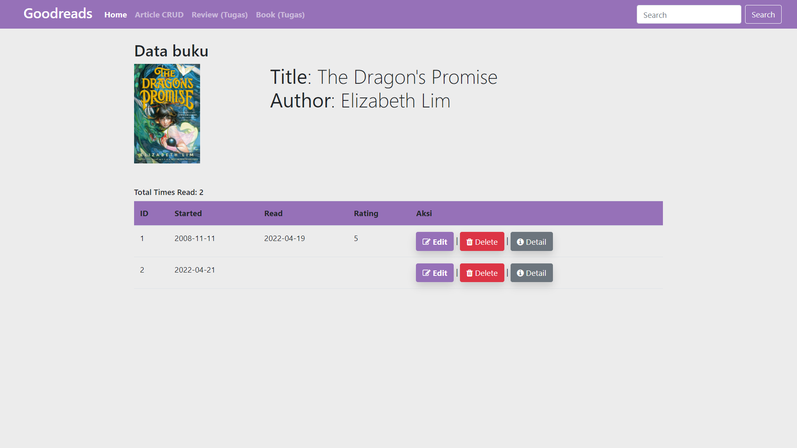

#### Tampilan Database Pada Tabel Review dan Buku
Pada tabel review hanya melakukan reference pada tabel buku sesuai dengan foreign id, dimana tabel buku berisi judul, penulis dan file buku. 
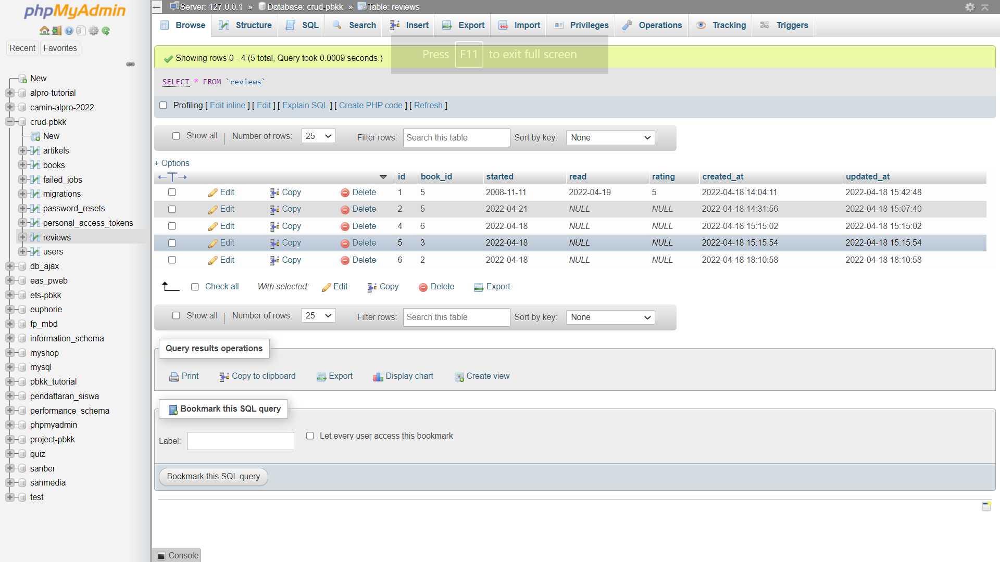
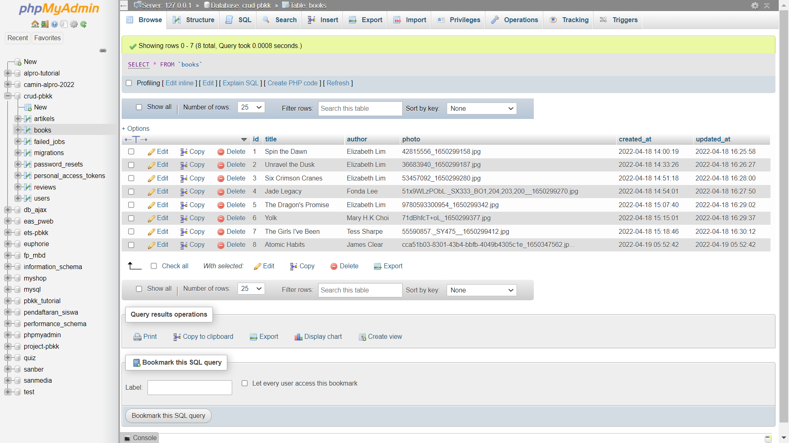
